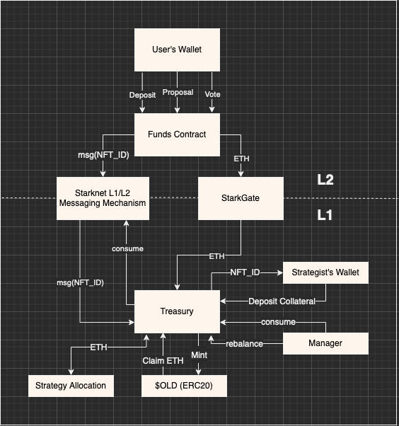
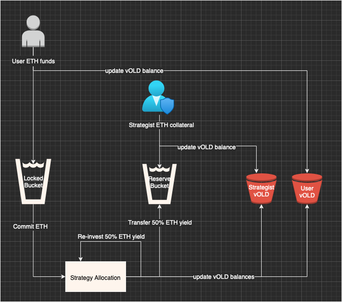

# Matusalem


(futuristic hedge fund trader)

* Website: https://glittery-narwhal-c50b36.netlify.app/
* Starknet contract: https://goerli-2.voyager.online/contract/0x0092bf28825b91673695eb6b34f009e1194be3a359aac1a88db54e592e6cfe66
* Treasury contract: https://goerli.etherscan.io/address/0x727caaeaEfa73D57ffF4Bbf180968210Ace73BF1
* $OLD ERC-20 contract: https://goerli.etherscan.io/address/0x7755E1DF5bfa6e06BBDEB7B2d9C2a8DE28c7309c
* Strategy NFT ERC-721 contract:  https://goerli.etherscan.io/address/0x15CC36D05fF82495Df3ECb161dfb78c6ff514193

A defined contribution, closed, pension fund in ETH. It allocates funds using a strategy defined by a third-party, using a "Chicken Bonds"-like mechanism, with transparent risk analysis and strategy optimization..

## Protocol

### Motivation
* Liquid staking protocols (Lido or Rocket Pool) are comparable to US Treasury bonds (as risk-free assets), enabling us to create a portfolio allocation similar to what pension funds do in the real world;
* [Chicken Bonds introduces a novel bonding mechanism](https://docsend.com/view/dakurpcuv3259bnx) which allows protocols to bootstrap liquidity at minimal cost and provides better user protection than existing bonding alternatives. We thought it might be cool to try to figure out how a mechanism like this could work in the context of a pension fund;
* Given the latest shenanigans around [LDI strategies](https://www.reuters.com/markets/europe/what-is-ldi-liability-driven-investment-strategy-explained-2022-10-04/) in UK pension funds, we thought that creating a system with transparent risk analysis and modelling would be very awesome;
* Users having a say in the governance of their capital allocation can be an interesting experiment;

### Overview

<p align="center">
  
</p>

### ETH flows and Chicken Bond 

<p align="center">
  
</p>

* Bond = ERC-721 representing the allocation strategy, minted by Strategist
* Locked Bucket (fund deposited by Fund)
* Reserve Bucket (Strategist collateral, yield from Locked Bucket)
* $vOLD (virtual balance representing a claim of the Reserve Bucket)
* $OLD (minted token that can claim ETH from Reserve Bucket at a redemption price)

### Chicken in, Chicken out, Egg to Maturity outcomes


## Asset Analysis


(pandas running on bacalhau)

### Obtaining historical prices

To generate a csv file with historical prices on a set of tokens you can run the python script:
(we are using the Coingecko API so pay attention to the token id's.)

```
python prices.py uniswap wrapped-bitcoin maker filecoin aave curve-dao-token nexo the-graph sandclock euler
```

This will create a csv called `prices.csv`

### Running data analysis on Bacalhau

Running this job on [bacalhau](https://docs.bacalhau.org/) will calculate correlation between tokens, standard deviations and average asset returns, while outputing this to a file called `final_state.txt`. It also generates an image of the correlations (see the example below to check the outputs). 

This way it can run the computation for larger datasets, improving cost and efficiency.

```bash
docker build -t finiam/matusalem-analysis15 . --platform linux/amd64
docker push finiam/matusalem-analysis15

bacalhau docker run finiam/matusalem-analysis15

# example result that you can check
# bacalhau get 80c51fcb-87b0-4eba-a2d4-e2ca3c0eca82
# bacalhau describe 80c51fcb-87b0-4eba-a2d4-e2ca3c0eca82
# 
# https://ipfs.io/ipfs/QmW9h1vJ7CSvfcYRt1fFJeVmeu63uNAjkBkU78b2ieGjhH/outputs
```

## Genetic Algorithms

### Developing the Genetic Algorithms
  
Most part of the code is inspired in the book: **Genetic Algorithms in Elixir** by Sean Moriarity [check here](https://pragprog.com/titles/smgaelixir/genetic-algorithms-in-elixir/). It has a bunch of updates in order to adapt to optimizing to asset weights and the fitness function to calculate the Sharpe Ratio.

- [How to calculate Sharpe Ration](https://www.wallstreetmojo.com/sharpe-ratio-formula/)
- [How to calculate Portfolio's Standard Deviation](https://www.wallstreetmojo.com/portfolio-standard-deviation/)

### Running the simulation on Bacalhau

The simulation and calculations for Sharpe Ratio, are quite heavy if we want to run for a big enough population age. This way, we can take advantage of `bacalhau`. Using `bacalhau` to run these algorithms also ensures we have a verifiable and transparent strategy definition.

```bash
docker build -t finiam/matusalem-genetic2 . --platform linux/amd64
docker push finiam/matusalem-genetic2

bacalhau docker run finiam/matusalem-genetic2

# example result that you can check
# bacalhau get 4db92773-135f-4053-b7a7-292b2dc36c95
# bacalhau describe 4db92773-135f-4053-b7a7-292b2dc36c95
```

## Current Problems

- We went way over our heads with this project so we struggled to have a deliverable by the end of the event;
- We are missing a way to trigger the Treasury contract on L1;
- We couldn't get funds on the new Starknet testnet;
- We faked the frontend wallet transactions, using sign insteads to exemplify the flow.
- We've just implemented a bare bones approach to the protocol that works for a simplified example; 
- The Genetic Algorithms work as expected and output a good result if we're using the overall expected returns for the portfolio, as the fitness function. However, when using the Sharpe Ratio as the fitness functions, the population doesn't evolve as expected, and it outputs a poor result;


## Future Work

- Add a chicken-bond like mechanism for the user's fund in the L2;
- Prove that the model makes sense and it's not just a fun experiment;
- Create a Manager to trigger rebalance functions and periodically trigger the consumption of L2 messages;
- Generalize the implementation from the implemeted example to the expected protocol behaviour;
- Actually integrate with the yield generating assets instead of mocks (i.e. Rocket Pool Staking, Euler Finance, Uniswap, etc);
